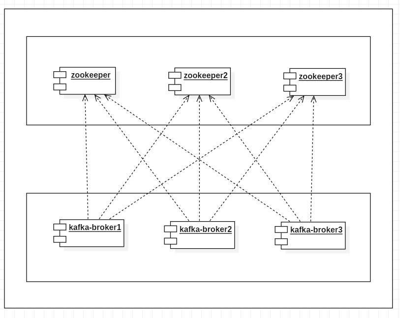
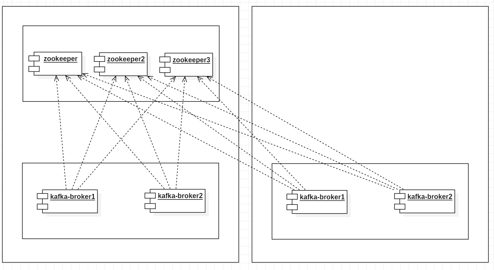
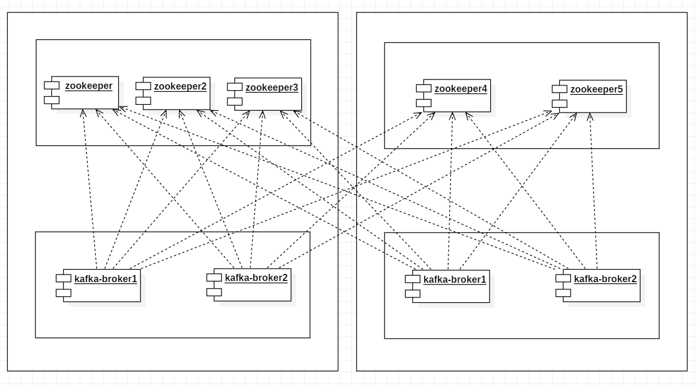
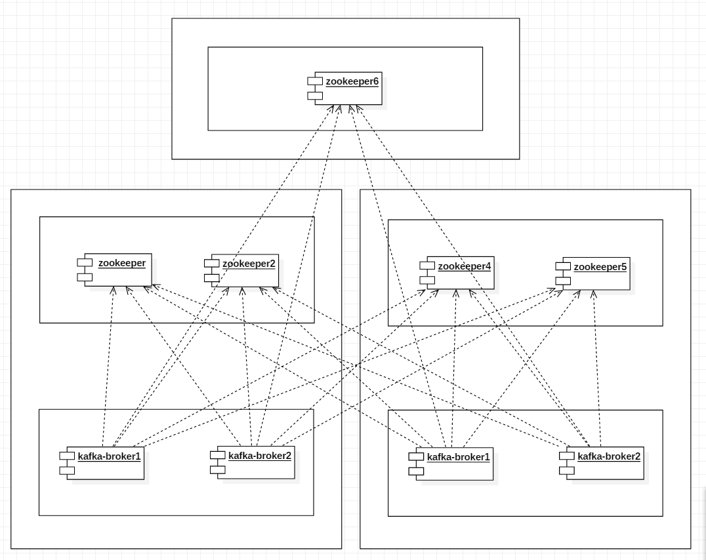

## kafka同城双活方案思考
https://istock.ssetech.com.cn/wiki/doku.php?id=service:techmag:201712_029:09

### kafka双活集群方案
如大家所知，这是一个典型的kafka部署架构图，如下：

我们的kafka集群所有节点都部署在同一个机房，可以满足我们一般场景下的消息传输。同一个机房的好处是很明显的，节点之间网络传输带宽高，延时低，很适合kafka这种对带宽要求高的产品。实际部署时，我们会将kafka的和zookeeper节点分别部署在不同ECS上，同时配置策略保证不同的ECS分布在不同物理机，这样我们能保证物理机级别容灾。  
不过在金融场景下，业务对消息中间件要求达到很高的可用性，仅仅物理机级别容灾，一般消息场景下够用，还不满足我们金融级别的可用性。那么，问题在哪里呢？ 
如果这个kafka集群所在的机房整体挂掉了怎么办？大家不要以为机房整体挂掉不可思议，这种情况不是没有发生过，比如机房光纤被挖断了怎么办？，比如前段时间的aws的光纤被挖断，还有去年的腾讯机房光纤被挖，给企业，同时也给用户造成很大的损失。

#### 同城双活架构方案
那么如果遇到机房整体挂掉的情况怎么办呢？我们只能等待网络运营商去修好光纤么？要知道企业损失是按照秒计算的。这种成本我们是承受不了的，于是我们调整了部署架构：

这个架构跟前面最大的区别是将kafka集群节点分布到两个机房了，他们构成了一个统一的集群。一般情况下这样的机房是同城两个机房，比如上海的张江机房，外高桥机房，机房间由光纤专线互联互通，同城机房间访问能达到ms级延迟（8ms）。 
该部署架构中，kafka集群节点分布到两个不同的机房，其中一个机房故障后，可以把外部访问流量切到另外一个机房，kafka客户端自动failover，业务服务不受影响。该部署架构提供了机房级别kafka服务高可用。

#### 同城双活架构方案补充
不过，这时该方案还无法保证kafka数据的高可用，因为其中一个机房挂掉之后，消费者无法消费该机房kafka节点的topic数据。基于kafka副本复制的原理，我们只需要分区的副本不要集中在同一个机房就可以了，这个时候我们有两种方式来实现： 
1，创建topic时指定分区数大于单一机房的集群节点数，比如kafka集群1在ECA机房有2个节点，在ecb有2个节点，创建topic的时候指定分区副本数n>2，由于同一分区副本会分布在不同broker节点上，所以必定在ecb和ecb的节点都有该分区的副本。 
2，kafka机架感知功能，配置broker.rack=rack-id-n，当创建Topic时，会遵从分组规则，确保单个partition的所有replicas被分散到尽可能多的组，最多会被分散到min(#racks, replication-factor) 个不同的组，这里以机房为单位分为两个机架组，副本数只要>=2，就能保证每个分区在每个机房都有副本。 
从上面的两种方案来看，第一种方式很直观，但是副本数越多，副本同步成本越高，n个副本复制流量为消息生产流量的n-1倍，按照ECA和ECB分别有2个broker节点的话，那么副本数至少为3。第二种方式很简单，也很轻量，我们可以将ECA的两个broker节点分为1组，ECB的两个broker节点分为另外1组，创建副本时，会保证副本分布到不同的分组中，这样副本数最少可以是2，就可以在保证数据高可用的同时，减少了副本复制，提高了性能。 
在这个时候，可能有人说了kafka集群已经跨机房了，可以保证机房级别kafka高可用了。是的，kafka 集群这时候确实可以保证很高的高可用了，哪怕是ECB机房挂了，ECA的kafka节点依然可以提供正常的服务，并且集群数据可以继续消费，不会丢失。

#### zookeeper集群高可用
细心的同学可能会发现，集群方案中zookeeper集群全部集中在ECA机房，ECA机房故障后，zookeeper集群也都挂掉了。我们知道，kafka集群依赖zookeeper集群实现元数据管理，比如topic元数据，分区元数据，broker节点元数据等。没有zookeeper集群，就无法构建起来kafka集群。前面架构中zookeeper集群所有节点都在ECA机房，这里会存在单点问题，ECA机房挂了之后，zookeeper集群也挂了，ECB集群中只有kafka节点，这时候kafka集群无法对外提供服务。
要解决当前架构的问题，我们进一步简化为解决zookeeper集群高可用问题，那么，我们该如何解决这个问题呢？ 
同样，按照以往的思维，我们可以把zookeeper集群分布在ECA和ECB两个机房，如架构图：

这样，ECA机房有3个zk节点，ECB机房有2个zk节点，共同组成一个zk集群。机房ECB挂了之后，ECA的3个zk节点依然可以为ECA的两个kafka节点提供zk服务，kafka集群依然可以对外提供无损的服务。

#### 我们的方案足够完善了么？
到了这里，有人会以为咱们的kafka同城双活方案已经非常完善了。其实，在这里zookeeper集群还有个比较大的问题：网络分区问题，如果eca机房挂了怎么办？

我们知道zookeeper是采用类似Paxos算法（ZAB算法）来保证集群建数据一致性问题的，强一致性，牺牲了一部分A，保证了CP。zookeeper集群由于使用的zab算法实现的一致性协议（类似paxos算法），zab算法要求保证节点半数以上存活，否则可能无法完成选举和更新操作（创建topic需要更新zk目录，消费消息提交offset也会更新zk目录以保存消费进度）。也就是说，在zk集群节点故障的情况，只要半数以上节点存活，ZAB算法依然可以保证zk集群继续提供可用服务。

我们来分析下，ECA机房挂了，3个zk节点挂了，2个broker节点挂了，还剩ECB的2个zk节点，2个broker节点，由于zookeeper集群中存活节点不到半数，无法提供服务，导致kafka集群也无法提供服务。
同样，让ECA和ECB的zk节点数一致，例如每个机房2个节点，也无法解决这个问题。
按照前面分析，存活下来的ECB机房有2个zookeeper节点，为原来zk集群节点数一半，按照zab算法，要zk节点数超过半数以上，zk集群才能继续提供可用服务，那么此时剩下的ECB集群因为zk集群原因，依然无法提供服务。甚至比前一种方案更惨，一旦其中一个机房故障，另外一个机房的剩下节点的kafka集群必定不可用。而前一种方案，ECB挂了之后，ECA剩下的集群还能正常提供kafka集群服务，在机房层面上至少能保证50%的可用性。
所以zk高可用问题就转化为了如何保证zk集群半数以上节点存活问题。

#### zookeeper集群同城多活
既然zookeeper集群必须要保证半数以上存活才能保证集群可用性，我们又只有ECA和ECB两个机房，那是不是zk集群同城高可用方案就走不通了？
其实不然，前面咱们说的kafka同城双活，我们并没有说zk也必须要双活呀，我们的目的是要保证zk集群高可用，我们可以让zk集群多活，比如三活，架构图如下：

这里，我们在另外一个机房ECC部署了zk节点加入到zk集群中，ECA和ECB机房中zk节点数相同，zk集群节点数=2n+m,n是eca和ecb机房的zk节点数，m是ecc机房的zk节点数，其中，m<2n（保证ecc挂掉不会导致zk集群不可用），2n+m一般保证为奇数（偶数会有1台节点浪费），例如m=1,n=1,zk集群节点为3。也就是说一旦ecc机房挂了之后，剩下eca和ecb机房的zk存活节点依然可以保证半数以上。
所以这个方案中，eca，ecb，ecc任意一个机房挂掉之后，剩下的zk集群依然可用，剩下的kafka集群依然可以提供服务。

到这里，kafka同城双活方案很完善了，有人可能又要问了，如果两个机房都挂掉了怎么办？其实挂掉一个机房的概率已经很小了，同时挂掉连个机房的概率就更小了。
有人可能还会问如果这个城市的所有机房都挂了怎么办？比如地震海啸什么的。那么这个就是灾备环境需要考虑的问题了

